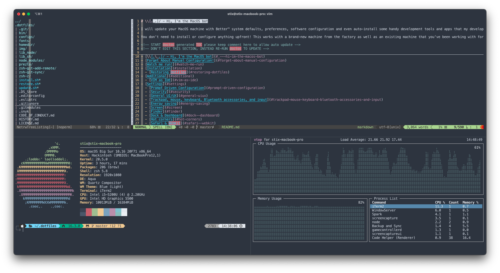

# \\[._.]/ - Hi, I'm the MacOS bot

I will update your MacOS machine with Better™ system defaults, preferences, software configuration and even auto-install some handy development tools and apps that my developer friends find helpful.

You don't need to install or configure anything upfront! This works with a brand-new machine from the factory as well as an existing machine that you've been working with for years.

<!-- START doctoc generated TOC please keep comment here to allow auto update -->
<!-- DON'T EDIT THIS SECTION, INSTEAD RE-RUN doctoc TO UPDATE -->

- [\\[._.]/ - Hi, I'm the MacOS bot](#_---hi-im-the-macos-bot)
  - [Forget About Manual Configuration](#forget-about-manual-configuration)
  - [Installation](#installation)
  - [Restoring Dotfiles](#restoring-dotfiles)
  - [Additional](#additional)
    - [VIM as Terminal IDE](#vim-as-terminal-ide)
  - [Settings](#settings)
    - [Prompt Driven Configuration](#prompt-driven-configuration)
    - [Security](#security)
    - [General UI/UX](#general-uiux)
    - [Trackpad, mouse, keyboard, Bluetooth accessories, and input](#trackpad-mouse-keyboard-bluetooth-accessories-and-input)
    - [Energy saving](#energy-saving)
    - [Screen](#screen)
    - [Finder](#finder)
    - [Dock & Dashboard](#dock--dashboard)
    - [Hot corners](#hot-corners)
    - [Spotlight](#spotlight)
    - [Time Machine](#time-machine)
    - [Address Book, Dashboard, iCal, TextEdit, and Disk Utility](#address-book-dashboard-ical-textedit-and-disk-utility)
    - [Activity Monitor](#activity-monitor)
    - [Mac App Store](#mac-app-store)
    - [Mail](#mail)
    - [Messages](#messages)
    - [Photos](#photos)
    - [Safari & WebKit](#safari--webkit)
    - [Google Chrome & Google Chrome Canary](#google-chrome--google-chrome-canary)
    - [Twitter](#twitter)
    - [Tweetbot](#tweetbot)
    - [VLC](#vlc)
    - [Xcode](#xcode)
    - [Visual Studio Code](#visual-studio-code)
    - [Transmission](#transmission)
    - [Spotify](#spotify)
    - [Terminal](#terminal)
  - [Software Installation](#software-installation)
    - [Taps](#taps)
    - [Utilities](#utilities)
    - [Apps](#apps)
    - [App Store](#app-store)
    - [VS Code Extensions](#vs-code-extensions)
    - [Node Packages](#node-packages)
  - [Credits](#credits)
  - [License](#license)
  - [Contributions](#contributions)
  - [Loathing, Mehs and Praise](#loathing-mehs-and-praise)
  - [¯\\_(ツ)_/¯ Warning / Liability](#ツ-warning--liability)

<!-- END doctoc generated TOC please keep comment here to allow auto update -->

## Forget About Manual Configuration

Don't you hate getting a new laptop or joining a new team and then spending a whole day setting up your system preferences and tools? Me too. That's why we automate; we did it once and we don't want to do have to do it again.

\\[^_^]/ - This started as [Adam Eivy](http://adameivy.com)'s MacOS shell configuration dotfiles but has grown to a multi-developer platform for machine configuration.

When I finish with your machine, you will have a fully configured development environment with a modern terminal emulator (Warp) and a customizable shell prompt.



The shell prompt uses Starship for cross-shell prompt customization, displaying useful information like:
- Current directory path
- Git branch and status
- Node.js version (via FNM)
- Command execution time
- And much more

The dotfiles configure Vim as a terminal-based IDE using Vundle for plugin management.

Modern terminal features:
- Warp: AI-powered terminal with native text editing
- Full-screen mode: `Command + Enter`

\\[._.]/ - I'm so excited I just binaried in my pants!

## Installation

> Note: I recommend forking this repo in case you don't like anything I do and want to set your own preferences (and pull request them!)
>
> REVIEW WHAT THIS SCRIPT DOES PRIOR TO RUNNING: [dotfiles](https://github.com/STiXzoOR/dotfiles/blob/main/bin/dotfiles)
>
> It's always a good idea to review arbitrary code from the internet before running it on your machine with sudo power!
> You are responsible for everything this script does to your machine (see LICENSE)

1. Remote Mode: Run this script in Terminal

```shell
bash -c "$(curl -fsSL https://raw.githubusercontent.com/STiXzoOR/dotfiles/main/remote-install.sh)"
```

2. Manual Mode

```shell
git clone --recurse-submodules https://github.com/STiXzoOR/dotfiles ~/.dotfiles
cd ~/.dotfiles
./bin/dotfiles install
```

> Note: running "dotfiles install" will install everything(zsh, apps, settings). If you want to do it manually, run "dotfiles install help" to list all the available commands.

## Restoring Dotfiles

If you have existing dotfiles for configuring git, zsh, vim, etc., these will be backed up into `~/.dotfiles_backup/$(date +"%Y.%m.%d.%H.%M.%S")` and replaced with the files from this project. You can restore your original dotfiles by using:

```shell
./bin/dotfiles unlink YYYY.MM.DD.HH.MM.SS
```

Where `YYYY.MM.DD.HH.MM.SS` is the timestamp of the backup you want to restore (check `~/.dotfiles_backup/` for available backups).

> The restore script does not currently restore system settings--only your original dotfiles. To restore system settings, you'll need to manually undo what you don't like (so don't forget to fork, review, and tweak before installing)

## Additional

### VIM as Terminal IDE

I am using `vim` as my terminal IDE. I use Vundle to manage vim plugins (instead of pathogen). Vundle is better in many ways and is compatible with pathogen plugins. Additionally, vundle will manage and install its own plugins so we don't have to use git submodules for all of them.

## Settings

This project changes a number of settings and configures software on MacOS.
Here is the current list:

### Prompt Driven Configuration

The following will only happen if you agree on the prompt

- make sudo command passwordless
- overwrite your /etc/hosts file with a copy from someonewhocares.org
- install prezto zsh framework
- link dotfiles
- install vim plugins/themes
- install fonts
- install brew, cask, code, mas, npm packages
- install LaunchAgents for automated tasks (mackup auto-backup every hour)
- change system configuration

### Security

- Enable install from Anywhere
- Disable remote apple events
- Disable remote login
- Disable wake-on modem
- Disable wake-on LAN
- Disable guest account login

### General UI/UX

- Set computer name (as done via System Preferences → Sharing)
- Disable the sound effects on boot
- Set highlight color to steel blue
- Set sidebar icon size to medium
- Always show scrollbars
- Disable the over-the-top focus ring animation
- Adjust toolbar title rollover delay
- Increase window resize speed for Cocoa applications
- Expand save panel by default
- Expand print panel by default
- Save to disk (not to iCloud) by default
- Automatically quit printer app once the print jobs complete
- Disable the “Are you sure you want to open this application?” dialog
- Remove duplicates in the “Open With” menu (also see 'lscleanup' alias)
- Display ASCII control characters using caret notation in standard text views
- Disable Resume system-wide
- Disable automatic termination of inactive apps
- Set Help Viewer windows to non-floating mode
- Reveal IP, hostname, OS, etc. when clicking clock in login window
- Disable automatic capitalization as it’s annoying when typing code
- Disable smart dashes as they’re annoying when typing code
- Disable automatic period substitution as it’s annoying when typing code
- Disable smart quotes as they’re annoying when typing code
- Disable auto-correct

### Trackpad, mouse, keyboard, Bluetooth accessories, and input

- Increase sound quality for Bluetooth headphones/headsets
- Enable full keyboard access for all controls (e.g. enable Tab in modal dialogs)
- Use scroll gesture with the Ctrl (^) modifier key to zoom
- Follow the keyboard focus while zoomed in
- Disable press-and-hold for keys in favor of key repeat
- Set a blazingly fast keyboard repeat rate
- Set language and text formats (english/GR)
- Show language menu in the top right corner of the boot screen
- Set timezone to Europe/Athens;

### Energy saving

- Disable lid wakeup
- Disable auto power off
- Disable auto restart on power loss
- Disable machine sleep
- Sleep the display after 60 minutes
- Disable standby mode
- Set standby delay to 24 hours (default is 1 hour)
- Disable wake from iPhone/Watch (eg. When iPhone or Apple Watch come near)
- Disable periodically wake of machine for network and updates
- Restart automatically if the computer freezes
- Disable hibernation (speeds up entering sleep mode)
- Remove the sleep image file to save disk space
- Create a zero-byte file instead…
- …and make sure it can’t be rewritten

### Screen

- Require password immediately after sleep or screen saver begins
- Save screenshots to the desktop
- Save screenshots in PNG format (other options: BMP, GIF, JPG, PDF, TIFF)
- Disable shadow in screenshots
- Enable subpixel font rendering on non-Apple LCDs
- Enable HiDPI display modes (requires restart)

### Finder

- Allow quitting via ⌘ + Q; doing so will also hide desktop icons
- Disable window animations and Get Info animations
- Set Desktop as the default location for new Finder windows
- Show icons for hard drives, servers, and removable media on the desktop
- Show hidden files by default
- Show all filename extensions
- Show status bar
- Show path bar
- Keep folders on top when sorting by name
- When performing a search, search the current folder by default
- Disable the warning when changing a file extension
- Enable spring loading for directories
- Remove the spring loading delay for directories
- Avoid creating .DS_Store files on network or USB volumes
- Disable disk image verification
- Automatically open a new Finder window when a volume is mounted
- Show item info near icons on the desktop and in other icon views
- Show item info to the right of the icons on the desktop
- Enable snap-to-grid for icons on the desktop and in other icon views
- Increase grid spacing for icons on the desktop and in other icon views
- Increase the size of icons on the desktop and in other icon views
- Use column list view in all Finder windows by default
- Use sort by Application in all Finder windows by default
- Disable the warning before emptying the Trash
- Empty Trash securely by default
- Show the ~/Library folder
- Show the /Volumes folder
- Expand the following File Info panes: “General”, “Open with”, and “Sharing & Permissions”

### Dock & Dashboard

- Set the icon size of Dock items to 36 pixels
- Change minimize/maximize window effect to scale
- Enable magnification
- Minimize windows into their application’s icon
- Enable spring loading for all Dock items
- Show indicator lights for open applications in the Dock
- Speed up Mission Control animations
- Remove the auto-hiding Dock delay
- Make Dock icons of hidden applications translucent
- Reset Launchpad, but keep the desktop wallpaper intact
- Add iOS & Watch Simulator to Launchpad

### Hot corners

- Top left screen corner → Mission Control
- Top right screen corner → Desktop
- Bottom left screen corner → Start screen saver

### Spotlight

- Change indexing order and disable some file types from being indexed
- Load new settings before rebuilding the index
- Make sure indexing is enabled for the main volume
- Rebuild the index from scratch

### Time Machine

- Prevent Time Machine from prompting to use new hard drives as backup volume
- Disable local Time Machine backups

### Address Book, Dashboard, iCal, TextEdit, and Disk Utility

- Enable the debug menu in Address Book
- Enable Dashboard dev mode (allows keeping widgets on the desktop)
- Use plain text mode for new TextEdit documents
- Open and save files as UTF-8 in TextEdit
- Use Meslo LGS Nerd Font in TextEdit
- Enable the debug menu in Disk Utility
- Auto-play videos when opened with QuickTime Player

### Activity Monitor

- Show the main window when launching Activity Monitor
- Visualize CPU usage in the Activity Monitor Dock icon
- Show all processes in Activity Monitor
- Sort Activity Monitor results by CPU usage
- Set columns for each tab
- Sort columns in each tab
- Update refresh frequency (in seconds)
- Show Data in the Disk graph (instead of IO)
- Show Data in the Network graph (instead of packets)
- Change Dock Icon

### Mac App Store

- Enable the WebKit Developer Tools in the Mac App Store
- Enable Debug Menu in the Mac App Store
- Enable the automatic update check
- Check for software updates daily, not just once per week
- Automatically download apps purchased on other Macs
- Turn on app auto-update

### Mail

- Disable send and reply animations in Mail.app
- Copy email addresses as 'foo@example.com' instead of 'Foo Bar <foo@example.com>' in Mail.app
- Add the keyboard shortcut ⌘ + Enter to send an email in Mail.app
- Display emails in threaded mode, sorted by date (oldest at the top)
- Disable inline attachments (just show the icons)
- Disable automatic spell checking

### Messages

- Disable automatic emoji substitution (i.e. use plain text smileys)
- Disable smart quotes as it’s annoying for messages that contain code
- Disable continuous spell checking

### Photos

- Prevent Photos from opening automatically when devices are plugged in

### Safari & WebKit

- Don’t send search queries to Apple
- Press Tab to highlight each item on a web page
- Show the full URL in the address bar (note: this still hides the scheme)
- Set Safari’s home page to ‘about:blank’ for faster loading
- Prevent Safari from opening ‘safe’ files automatically after downloading
- Allow hitting the Backspace key to go to the previous page in history
- Hide Safari’s bookmarks bar by default
- Hide Safari’s sidebar in Top Sites
- Disable Safari’s thumbnail cache for History and Top Sites
- Enable Safari’s debug menu
- Make Safari’s search banners default to Contains instead of Starts With
- Remove useless icons from Safari’s bookmarks bar
- Enable the Develop menu and the Web Inspector in Safari
- Add a context menu item for showing the Web Inspector in web views
- Enable continuous spellchecking
- Disable auto-correct
- Disable AutoFill
- Warn about fraudulent websites
- Disable plug-ins
- Disable Java
- Block pop-up windows
- Enable Do Not Track
- Update extensions automatically

### Google Chrome & Google Chrome Canary

- Disable the all too sensitive backswipe on trackpads
- Disable the all too sensitive backswipe on Magic Mouse
- Use the system-native print preview dialog
- Expand the print dialog by default

### Twitter

- Disable smart quotes as it’s annoying for code tweets
- Show the app window when clicking the menu bar icon
- Enable the hidden ‘Develop’ menu
- Open links in the background
- Allow closing the ‘new tweet’ window by pressing $(Esc)
- Show full names rather than Twitter handles
- Hide the app in the background if it’s not the front-most window

### Tweetbot

- Bypass the annoyingly slow t.co URL shortener

### VLC

- Install settings

### Xcode

- Create xcode custom theme folder
- Install nord theme
- Change theme to nord
- Trim trailing whitespace
- Trim whitespace only lines
- Show line numbers
- Reduce the number of compile tasks and stop indexing
- Show all devices and their information you have plugged in before
- Show ruler at 80 chars
- Map ⌃⌘L to show last change for the current line
- Show build time
- Improve performance
- Improve performance by leveraging multi-core CPU
- Delete these settings

### Visual Studio Code

- Install settings

### Transmission

- Use ~/Documents/Torrents to store incomplete downloads
- Use ~/Downloads to store completed downloads
- Don’t prompt for confirmation before downloading
- Don’t prompt for confirmation before removing non-downloading active transfers
- Trash original torrent files
- Enabling queue
- Setting queue maximum downloads
- Hide the donate message
- Hide the legal disclaimer
- Setting IP block list
- Randomize port on launch

### Spotify

- Change theme to nord

### Terminal

- Only use UTF-8 in Terminal.app
- Install nord theme in Terminal.app
- Use nord theme by default in Terminal.app
- Enable "focus follows mouse" for Terminal.app and all X11 apps

## Software Installation

Homebrew, fontconfig, git, FNM (Fast Node Manager for Node.js + npm), and zsh (latest) are all installed as foundational software for running this project.
Additional software is configured in `packages/` directory and can be customized in your own fork/branch.
The following is the software installed by default:

### Taps

- Homebrew/Bundle
- Homebrew/Cask
- Homebrew/Cask Drivers
- Homebrew/Cask Versions
- Homebrew/Cask Fonts
- Homebrew/Core
- Homebrew/Dupes
- Homebrew/Services
- Khanhas/Tap
- Mongodb/Brew

### Utilities

**Core/Dotfiles:**
- ack, ag (the_silver_searcher)
- bats-core
- coreutils, dos2unix
- dockutil
- mackup, mas
- starship (cross-shell prompt)
- stow (dotfile symlink management)
- thefuck
- topgrade (universal package upgrader)

**File System/Network:**
- bat (cat replacement)
- croc (file transfer)
- eza (ls replacement)
- httpie
- ssh-copy-id
- tree, unar
- wget
- zoxide (cd replacement)

**Search/Grep/Diff:**
- fd (find replacement)
- findutils
- fzf (fuzzy finder)
- gawk
- git-delta (diff viewer)
- gnu-sed
- grep
- jq, yq (JSON/YAML processors)
- psgrep
- readline
- ripgrep (fast grep)

**Languages/Tools:**
- cmake
- gh (GitHub CLI)
- go
- python
- shellcheck, shfmt

**Media:**
- ffmpeg
- imagemagick
- optipng
- uni
- webp
- youtube-dl

**Misc:**
- grip (GitHub README preview)
- sudo-touchid

### Apps

**Creative & Design:**
- Adobe Creative Cloud
- Figma

**Development:**
- Arduino, Arduino IDE
- Autodesk Fusion
- GitKraken
- Sourcetree
- Visual Studio Code

**Browsers:**
- Brave Browser
- Firefox
- Google Chrome

**Media:**
- IINA (modern media player)
- Spotify
- VLC

**Utilities:**
- AltServer
- AnyDesk
- Apparency
- BalenaEtcher
- Discord
- Flux
- Keka (archiver)
- KeyCastr
- Kaleidoscope (diff tool)
- Karabiner Elements (keyboard customizer)
- Ngrok
- Notion
- ProtonVPN
- PrusaSlicer/SuperSlicer
- Raycast (Spotlight replacement)
- Setapp
- Shottr (screenshot tool)
- Slack
- TeamViewer
- Telegram
- TopNotch
- Transmission
- Tunnelblick
- Zoom

**Terminals:**
- Warp

**Fonts:**
- Font Awesome Terminal Fonts
- Font Fira Code
- Font Fira Mono
- Font Fira Code Nerd Font
- Font Fira Mono Nerd Font
- Font Fontawesome
- Font Geist Mono Nerd Font
- Font Hack
- Font Hack Nerd Font
- Font Inter
- Font Menlo For Powerline
- Font Meslo For Powerline
- Font Meslo LG
- Font Meslo LG Nerd Font
- Font Roboto Mono Nerd Font

**QuickLook Plugins:**
- qlmarkdown
- qlstephen
- qlvideo
- quicklook-json
- quicklookase
- suspicious-package
- syntax-highlight

### App Store

- Emby
- LastPass
- Magnet
- Messenger
- Microsoft Remote Desktop
- Paste
- Spark
- Trello
- Twitter

### VS Code Extensions

- Rainbow Brackets
- Better Comments
- Nord Visual Studio Code
- Github Markdown Preview
- Markdown Checkbox
- Markdown Emoji
- Markdown Preview Github Styles
- Markdown Yaml Preamble
- Multi Line Tricks
- StandardJS
- Npm Intellisense
- Bracket Pair Colorizer 2
- Markdown Lint
- Eslint
- Githistory
- Python Extension Pack
- Gitlens
- Editorconfig
- Prettier
- Shell Format
- Styled Components
- Duplicate Selection
- Magic Python
- Auto Build
- Dotenv
- Python
- Pylance
- Jupyter
- Cpp Tools
- Typescript Tslint
- Color Highlight
- Printcode
- Prettier Standard
- Indent Rainbow
- Nested Comments
- PlatformIO IDE
- Polacode
- Savebackup
- Quicktype
- Sort Json
- Code Settings Sync
- Brewfile
- Autoimport
- Open In Browser
- Sort Lines
- Highlight Matching Tag
- Intellicode
- Icons
- Import Cost
- Change Case
- Markdown All In One

### Node Packages

**AI Tools:**
- @anthropic-ai/claude-code
- @google/gemini-cli

**Package Management:**
- npm (latest)
- pnpm
- yarn
- corepack

**Development Tools:**
- eslint
- prettier
- detect-circular-deps
- nodemon
- tsx (TypeScript executor)

**CLI Utilities:**
- fkill-cli (kill processes)
- get-port-cli
- fast-cli (internet speed test)
- gtop (system monitoring)

**Build Tools:**
- grunt-cli
- gulp-cli

**Maintenance:**
- npm-check-updates

**Publishing:**
- release-it

**Misc:**
- instant-markdown-d
- local-web-server
- svgo (SVG optimizer)
- tldr (simplified man pages)
- underscore-cli

## Credits

- [Adam Eivy](https://github.com/atomantic) for the actual [dotfiles](https://github.com/atomantic/dotfiles)
- [Lars Kappert](https://github.com/webpro) for some of the scripts and tools used in his [dotfiles](https://github.com/webpro/dotfiles)

## License

This project is licensed under ISC. Please fork, contribute and share.

## Contributions

Contributions are always welcome in the form of pull requests with explanatory comments.

Please refer to the [Contributor Covenant](https://github.com/STiXzoOR/dotfiles/blob/main/CODE_OF_CONDUCT.md)

## Loathing, Mehs and Praise

1. Loathing should be directed into pull requests that make it better. woot.
2. Bugs with the setup should be put as GitHub issues.
3. Mehs should be > /dev/null

## ¯\\_(ツ)_/¯ Warning / Liability

> Warning:
> The creator of this repo is not responsible if your machine ends up in a state you are not happy with. If you are concerned, look at the code to review everything this will do to your machine :)
